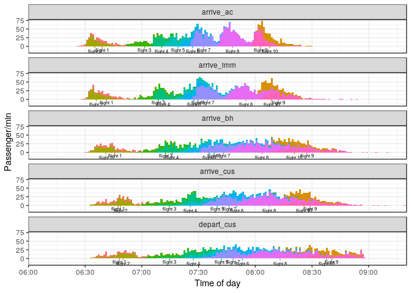

<!-- README.md is generated from README.Rmd. Please edit that file -->
AirportSim
==========

The goal of AirportSim is to demonstrate how queuecomputer can be used to quickly simulate a large scale system. In this case, an airport.

Installation
------------

You can install AirportSim from github with:

``` r
# install.packages("devtools")
devtools::install_github("AnthonyEbert/AirportSim")
```

Example
-------

This is a basic example which shows you how to solve a common problem:

``` r

library(AirportSim)

# Input data
airport_list_1
#> $global_level
#>   distance_dpl distance_imm distance_bh   mu  vm2   lag rate_bags nu_bags
#> 1          100          150          80 0.02 0.64 0.005         4     1.2
#>   server_bags server_cus rate_cus
#> 1           8         10        3
#> 
#> $flight_level
#> # A tibble: 10 x 7
#>    flight    arrive  gate passengers scale_dpl shape_dpl p_nat    
#>    <chr>      <dbl> <dbl>      <dbl>     <dbl>     <dbl> <list>   
#>  1 flight 1     10.    1.       150.      4.20      3.70 <dbl [2]>
#>  2 flight 2     30.    2.       200.      2.80      2.00 <dbl [2]>
#>  3 flight 3     50.    3.       200.      4.20      3.30 <dbl [2]>
#>  4 flight 4     65.    2.       250.      3.10      2.10 <dbl [2]>
#>  5 flight 5     72.    4.       250.      4.00      2.10 <dbl [2]>
#>  6 flight 6     80.    2.       180.      3.40      2.60 <dbl [2]>
#>  7 flight 7     85.    1.       470.      3.00      2.80 <dbl [2]>
#>  8 flight 8    100.    3.       620.      3.40      2.70 <dbl [2]>
#>  9 flight 9    118.    4.       300.      2.20      2.40 <dbl [2]>
#> 10 flight 10   120.    2.       310.      3.30      2.70 <dbl [2]>
#> 
#> $gate_level
#> # A tibble: 5 x 4
#>    gate distance_gate lag_bags handler
#>   <dbl>         <dbl>    <dbl> <chr>  
#> 1    1.           80.       5. team A 
#> 2    2.           30.      15. team A 
#> 3    3.          300.       5. team B 
#> 4    4.          450.       5. team B 
#> 5    5.          800.      10. team B 
#> 
#> $nat_level
#> # A tibble: 2 x 3
#>   nat     rate_imm server_imm
#>   <chr>      <dbl> <list>    
#> 1 foreign     1.20 <S3: list>
#> 2 local       1.60 <dbl [1]>

# Run simulation
passenger_table <- do.call(AirportSimulate1, airport_list_1)

# Show output
passenger_table
#> # A tibble: 2,930 x 42
#>    flight   arrive  gate passengers scale_dpl shape_dpl p_nat        ID
#>    <chr>     <dbl> <dbl>      <dbl>     <dbl>     <dbl> <list>    <int>
#>  1 flight 1    10.    1.       150.      4.20      3.70 <dbl [2]>     1
#>  2 flight 1    10.    1.       150.      4.20      3.70 <dbl [2]>     2
#>  3 flight 1    10.    1.       150.      4.20      3.70 <dbl [2]>     3
#>  4 flight 1    10.    1.       150.      4.20      3.70 <dbl [2]>     4
#>  5 flight 1    10.    1.       150.      4.20      3.70 <dbl [2]>     5
#>  6 flight 1    10.    1.       150.      4.20      3.70 <dbl [2]>     6
#>  7 flight 1    10.    1.       150.      4.20      3.70 <dbl [2]>     7
#>  8 flight 1    10.    1.       150.      4.20      3.70 <dbl [2]>     8
#>  9 flight 1    10.    1.       150.      4.20      3.70 <dbl [2]>     9
#> 10 flight 1    10.    1.       150.      4.20      3.70 <dbl [2]>    10
#> # ... with 2,920 more rows, and 34 more variables: distance_gate <dbl>,
#> #   lag_bags <dbl>, handler <chr>, nat <chr>, rate_imm <dbl>,
#> #   server_imm <list>, walk_speed <dbl>, deplane <dbl>, arrive_ac <dbl>,
#> #   walk_ac <dbl>, arrive_imm <dbl>, service_imm <dbl>, depart_imm <dbl>,
#> #   walk_imm <dbl>, n_bags <int>, arrive_bh <dbl>, walk_bh <dbl>,
#> #   last_bag <dbl>, depart_bh <dbl>, arrive_cus <dbl>, service_cus <dbl>,
#> #   `n_bags == 0` <lgl>, depart_cus <dbl>, system_dpl <dbl>,
#> #   system_ac <dbl>, system_imm <dbl>, system_bh <dbl>, system_cus <dbl>,
#> #   system_bags <dbl>, system_total <dbl>, wait_imm <dbl>, wait_bh <dbl>,
#> #   wait_cus <dbl>, wait_bags <dbl>

system.time(do.call(AirportSimulate1, airport_list_1))
#>    user  system elapsed 
#>   0.080   0.000   0.079
```

Voilla! Have a look at the source code in R/AirportSimulate1.R

``` r

library(ggplot2)
library(dplyr)
#> 
#> Attaching package: 'dplyr'
#> The following objects are masked from 'package:stats':
#> 
#>     filter, lag
#> The following objects are masked from 'package:base':
#> 
#>     intersect, setdiff, setequal, union

x <- c("arrive_ac", "arrive_imm", "arrive_bh", "arrive_cus", "depart_cus")

out2 <- 
  tidyr::gather(
    passenger_table %>% select(flight, arrive_ac, arrive_imm, arrive_bh, arrive_cus, depart_cus), 
    key = "key", 
    value = "value", 
    -flight
  ) %>% 
  mutate(key = factor(key, levels = x)) %>% 
  arrange(key) 

out2_grouped <- out2 %>% group_by(flight, key) %>% summarise(value = median(value), passengers = n())

p <- ggplot(out2) + aes(x = value, fill = factor(flight)) + stat_bin(position = "stack", bins = 200, col = NA) + ylab("Passenger/min") + xlab("Time of day")  +
  geom_linerange(mapping = aes(x = value, ymin = -5, ymax = 0, col = factor(flight)), data = out2_grouped) + 
  scale_x_continuous(labels = scales::trans_format( function(x){x}, function(x){substr(lubridate::as_datetime(x * 60 + 360 * 60), 12, 16)} ), breaks = (seq(0,5, by = 0.5))*60, expand = c(0, 0), limits = c(0, 200)) +
  geom_text(mapping = aes(x = value, y = ifelse((as.numeric(substr(flight, start = 7, stop = 12)) %% 2) == 0,-15,-10), label = flight), data = out2_grouped, size = 2) + theme_bw() + theme(legend.position = "none")

p + facet_wrap(~key, ncol = 1) 
#> Warning: Removed 100 rows containing missing values (geom_bar).
```


